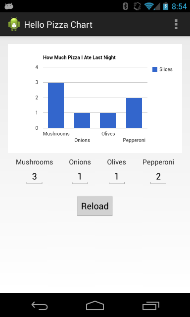

Hello Pizza Chart
=================

A sample Android application to demo usage of the [Google Charts][1] Javascript API in a native [WebView][2] container.

```
$ git clone git@github.com:ecgreb/hello-pizza-chart.git
$ cd hello-pizza-chart
$ mvn clean install
$ mvn android:deploy android:run
```



[1]: https://developers.google.com/chart/
[2]: https://developer.android.com/reference/android/webkit/WebView.html
